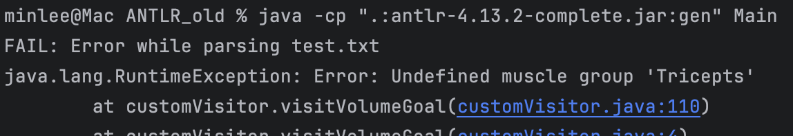
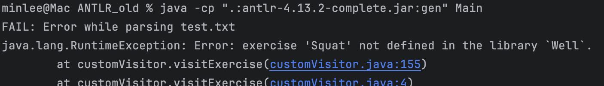
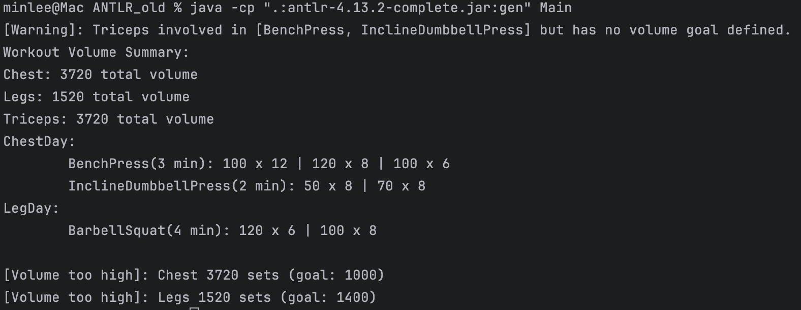
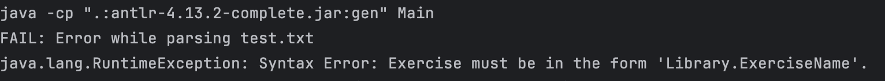

**GymLang**

Overview
================

GymLang is a domain-specific language (DSL) designed to structure and plan weight-training workout programs in a human-readable and programmable format. It allows fitness enthusiasts, trainers, and software systems to:

- Define muscles and their corresponding workout routines
- Reuse complex set structures like Pyramid and Drop Sets
- Track workout volume for muscle groups
- Automatically identify errors or inconsistencies in routines

This system is particularly valuable for users who want to automate checks for overtraining, missing muscle targets, or undefined behaviors in a workout program.

Application Example
===================

Consider the following example:

~~~~~
MuscleGroup {
    Chest, Back, Shoulders, Biceps, Triceps, Legs
}

Gym Well {
    BenchPress(Chest, Triceps),
    PullUp(Back, Biceps),
    MilitaryPress(Shoulders, Triceps),
    BarbellCurl(Biceps),
    Deadlift(Back, Legs),
    LegPress(Legs)
}

defineSet ReversePyramid(weight, reps) {
    Set(weight, reps)
    Set(weight - 20, reps + 2)
    Set(weight - 40, reps + 4)
}

defineSet Pyramid(weight, reps) {
    Set(weight, reps)
    Set(weight + 20, reps - 2)
    Set(weight + 40, reps - 4)
    Set(weight - 10, reps + 2)
    Set(weight - 20, reps + 4)
}

start program HypertrophyBoost

    timePerSession = 90
    daysPerWeek = 5

    Chest volume = 2400
    Back volume = 3000
    Legs volume = 2800
    Shoulders volume = 1800
    Biceps volume = 1600
    Triceps volume = 1600

    PushDay {
        Well.BenchPress rest 3minutes:
            use Set.ReversePyramid(100, 10)

        Well.MilitaryPress rest 2minutes:
            Set(60, 10)
            Set(50, 12)
    }

    PullDay {
        Well.PullUp rest 2minutes:
            Set(60, 12)
            Set(60, 10)

        Well.BarbellCurl rest 2minutes:
            use Set.Pyramid(30, 10)
    }

    LegDay {
        Well.Deadlift rest 4minutes:
            Set(140, 6)
            Set(120, 8)

        Well.LegPress rest 2minutes:
            Set(180, 12)
            Set(160, 12)
    }

    Week {
        PushDay,
        PullDay,
        LegDay
    }

end
~~~~~

**Output**
~~~~~
Workout Volume Summary:
Chest: 2800 total volume
Legs: 5880 total volume
Shoulders: 1200 total volume
Back: 3120 total volume
Triceps: 4000 total volume
Biceps: 2820 total volume
PushDay:
        BenchPress(3 min): 100.0 x 10 | 80.0 x 12 | 60.0 x 14
        MilitaryPress(2 min): 60.0 x 10 | 50.0 x 12
PullDay:
        PullUp(2 min): 60.0 x 12 | 60.0 x 10
        BarbellCurl(2 min): 30.0 x 10 | 50.0 x 8 | 70.0 x 6 | 20.0 x 12 | 10.0 x 14
LegDay:
        Deadlift(4 min): 140.0 x 6 | 120.0 x 8
        LegPress(2 min): 180.0 x 12 | 160.0 x 12

[Volume too high]: Chest 2800 (goal: 2400)
[Volume too high]: Legs 5880 (goal: 2800)
[Volume too low]: Shoulders 1200 (goal: 1800)
[Volume too high]: Back 3120 (goal: 3000)
[Volume too high]: Triceps 4000 (goal: 1600)
[Volume too high]: Biceps 2820 (goal: 1600)
~~~~~
The program calculates the total volume for each muscle group and alerts the user if a volume exceeds the defined goal. It also validates routine definitions and structure.

Grammar
=============
A GymLang program consists of three major declarations followed by a program definition.

### 1. `MuscleGroup` Declaration
- Lists all the muscle groups targeted in the program.
- Each muscle group name must start with a capital letter and be comma-separated within braces.
- Example:
  ```
  MuscleGroup {
      Chest, Back, Shoulders, Biceps, Triceps, Legs
  }
  ```

### 2. `Gym` Declaration
- Declares available exercises in a gym.
- Each exercise starts with a capital letter and specifies the muscle groups it targets.
- Syntax: `ExerciseName(MuscleGroup1, MuscleGroup2, ...)`
- Example:
  ```
  Gym Well {
      BenchPress(Chest, Triceps),
      PullUp(Back, Biceps)
  }
  ```

### 3. `defineSet` Declaration
- Defines custom set patterns for reuse.
- Must include a name and parameter list `(weight, reps)` and one or more `Set(...)` statements inside.
- Example:
  ```
  defineSet Pyramid(weight, reps) {
      Set(weight, reps)
      Set(weight + 20, reps - 2)
      Set(weight - 10, reps + 2)
  }
  ```
- These sets are easily customizable at the time of usage.
- Example:
  ```
  use Set.Pyramid(70,12):
    + Set(70,12)                // Add another set
    - Set 1                     // Remove the first set
    change Set1 to Set(50, 8)   // Change the first set to a custom set
  ```

### 4. Program Definition
- Begins with `start program ProgramName` and ends with `end`.
- Includes metadata (`timePerSession`, `daysPerWeek`, and volume goals).
- Defines day-wise routines and weekly schedule using previously declared muscles, exercises, and sets.

- Example structure:
  ```
  start program HypertrophyBoost
      timePerSession = 90
      daysPerWeek = 5

      Chest volume = 2400
      ...

      PushDay {
          Well.BenchPress rest 3minutes:
              use Set.Pyramid(100, 10)
      }

      Week {
          PushDay,
          PullDay
      }
  end
  ```


Author
=============

David Lee

Implementations
================

Correct Input
--------------------------------
~~~~~
MuscleGroup {
    Chest, Triceps, Biceps, Shoulders, Back, Legs, Abs
}

Gym Well {
    BenchPress(Chest, Triceps),
    InclineDumbbellPress(Chest, Triceps),
    BarbellSquat(Legs)
    FrontSquat(Leggs)
}

defineSet Pyramid(weight, reps) {
    Set(weight, reps)
    Set(weight + 20, reps - 2)
    Set(weight + 40, reps - 4)
    Set(weight - 30, reps + 2)
    Set(weight - 60, reps + 4)
}

defineSet Drop(weight, reps) {
    Set(weight, reps)
    Set(weight - 10, reps)
    Set(weight - 20, reps)
    Set(weight - 30, reps)
}


start program MuscleGrowth
    
    timePerSession = 100
    daysPerWeek = 4
    
    Chest volume = 1000
    Legs volume = 1400
    Triceps volume = 3000

    ChestDay {
         Well.BenchPress rest 3minutes:
             Set(100, 12)
             Set(120, 8)
             Set(100, 6)

         Well.InclineDumbbellPress rest 2minutes:
             use Set.Pyramid(70,12):
                + Set(70,12)
                - Set 1
                change Set1 to Set(50, 8)
    }

    LegDay {
        Well.BarbellSquat rest 4minutes:
            Set(120, 6)
            Set(100, 8)
    }

    Week {
     ChestDay,
     LegDay,
     // ArmsDay,
     // ChestDay2
    }
    
end
~~~~~

**Output**
~~~~~~
Workout Volume Summary:
Chest: 5600 total volume
Legs: 1520 total volume
Triceps: 5600 total volume
ChestDay:
        BenchPress(3 min): 100.0 x 12 | 120.0 x 8 | 100.0 x 6
        InclineDumbbellPress(2 min): 50.0 x 8 | 110.0 x 8 | 40.0 x 14 | 10.0 x 16 | 70.0 x 12
LegDay:
        BarbellSquat(4 min): 120.0 x 6 | 100.0 x 8

[Volume too high]: Chest 5600 (goal: 1000)
[Volume too high]: Legs 1520 (goal: 1400)
[Volume too high]: Triceps 5600 (goal: 3000)

~~~~~

Incorrect Input
--------------------------------
### Duplicate Muscle Group
~~~~~
MuscleGroup {
    Chest, Chest, Triceps, Biceps, Shoulders, Back, Legs, Abs //Chest defined twice
}
~~~~~
**Output**
~~~~~
FAIL: Error while parsing test.txt
java.lang.RuntimeException: Error: Duplicate muscle group detected - 'Chest'
        at customVisitor.visitMuscleList(customVisitor.java:53)
        at customVisitor.visitMuscleList(customVisitor.java:9)
        at GymlangParser$MuscleListContext.accept(GymlangParser.java:278)

~~~~~
### Negative Weight or reps
~~~~~
defineSet Pyramid(weight, reps) {
    Set(weight, reps)
    Set(weight + 20, reps - 50) // reps subtracted too much
}
...
Well.InclineDumbbellPress rest 2minutes:
             use Set.Pyramid(70,12):
~~~~~
**Output**
~~~~~
java.lang.RuntimeException: Error: weight or rap goes below zero at Pyramid
...
~~~~~
### Undefined Muscle Group
1. Muscle group not found in **program** definition
~~~~~
MuscleGroup {
    Chest, Triceps, Biceps, Shoulders, Back, Legs, Abs
}

Gym Well {
    BenchPress(Chest, Triceps),
    InclineDumbbellPress(Chest, Triceps),
    BarbellSquat(Legs)
}

start program MuscleGrowth
    
    timePerSession = 100
    daysPerWeek = 4
    
    Chest volume = 1000
    Legs volume = 1400
    Tricepts volume = 3000      // Typo in Tricepts
...
~~~~~
**Output**


2. Muscle group not found in **library** definition
~~~~~
MuscleGroup {
    Legs
}

Gym Well {
    FrontSquat(Leggs)
}
...
~~~~~
**Output**
`java.lang.RuntimeException: Error: Undefined muscle group 'Leggs' in exercise 'FrontSquat'`

### Undefined Exercise
~~~~~
MuscleGroup {
    Chest, Triceps, Biceps, Shoulders, Back, Legs, Abs
}

Gym Well {
    BenchPress(Chest, Triceps),
    InclineDumbbellPress(Chest, Triceps),
    BarbellSquat(Legs)
}

start program MuscleGrowth
    
    timePerSession = 100
    daysPerWeek = 4
    
    Chest volume = 1000
    Legs volume = 1400
    Triceps volume = 3000     

    LegDay {
        Well.Squat rest 4minutes:    // Squat undefined in 'Well'
            Set(120, 6)
            Set(100, 8)
    }
~~~~~

**Output:**



### Goal Undefined
1. timePerSession
~~~~~
start program MuscleGrowth
    
    // Missing time per session
    daysPerWeek = 4
~~~~~

**Output:**

~~~~~
java.lang.RuntimeException: Syntax Error: Expected 'timePerSession = number' but found 'null'
~~~~~
2. daysPerWeek
~~~~~
start program MuscleGrowth
    
    timePerSession = 100
    // Missing days per week
~~~~~

**Output:**
~~~~~
java.lang.RuntimeException: Syntax Error: Expected 'daysPerWeek = number' but found 'null'
~~~~~


3. Volume Goal
~~~~~
...
start program MuscleGrowth
    
    timePerSession = 100
    daysPerWeek = 4
    
    Chest volume = 1000
    Legs volume = 1400
    // Triceps volume = 3000

    ChestDay {
         Well.BenchPress rest 3minutes:   // Involves Triceps but Triceps volume goal is not defined
             Set(100, 12)
             Set(120, 8)
             Set(100, 6)
~~~~~

**Output:**
Prints warning:
`[Warning]: Triceps involved in [BenchPress, InclineDumbbellPress] but has no volume goal defined.`


### Gym library not imported
~~~~~
ArmDay {
    BarbellCurl rest 2minutes: // Missing well.
        Set(30,12)
}
~~~~~

**Output:**
Prints warning:



### Day routine not defined
~~~~~
start program MuscleGrowth
    
    timePerSession = 100
    daysPerWeek = 4

    Chest volume = 1000
    Legs volume = 1400
    Triceps volume = 3000

    LegDay {
        Well.BarbellSquat rest 4minutes:
            Set(120, 6)
            Set(100, 8)
    }


    Week {
     LegDay,
     ArmDay    // ArmDay is not defined
    }
    
end
~~~~~

**Output:**
`java.lang.RuntimeException: Error: ArmDay is not defined.`

Reflection
==========
## Comparsion with General-Purpose Languages and Manual Approaches

Using a general-purpose languages (like Python or Java) or managing workout plans manually can achieve similar outputs,
but GymLang provides several distinct advantages:
### 1. Design with Good Readability and Intentional Design
- GymLang is specifically designed for workout structuring. A routine like `use Set.Pyramid(30,10)`clearly communicates the programmer's intent than a sequence of loops and conditionals in Python.
- Fitness-specific concepts like muscle groups, rest times, and goal volumes are friendly to the desired audience.

### 2. Validation and Error Checking
- Manually tracking muscle volume or detecting incosistnecies can be tedious and error-prone.
- GymLang includes built-in checks for goal mismatches, typos, undefined exercises, and routine structures.

### 3. Modularity and Reuse
- Constructs lilke `defineSet Pyramid(...)` are reusable and usuable in complex workout sturctures.
    - It will be even helpful if they can be imported as a library in future.
- It reduces complexity compared to a general-purpose languages

### 4. Domain-Specific Error Messages
- GymLang provides domain-specific feedback such as:
    -`[Volume too hight]`
    -`Error: Undefined muscle group`

### 5. Better Structured Output
- GymLang produces a structure specifically designed for a workout plan
- This reduces implementation effort and programming knowledge for users